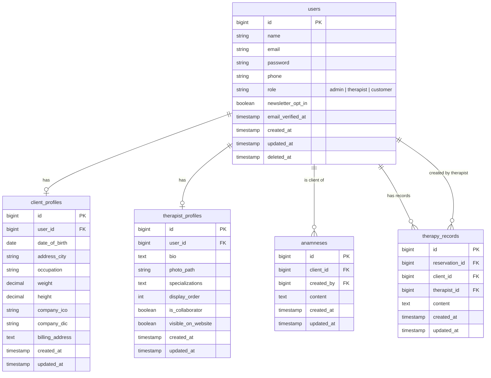
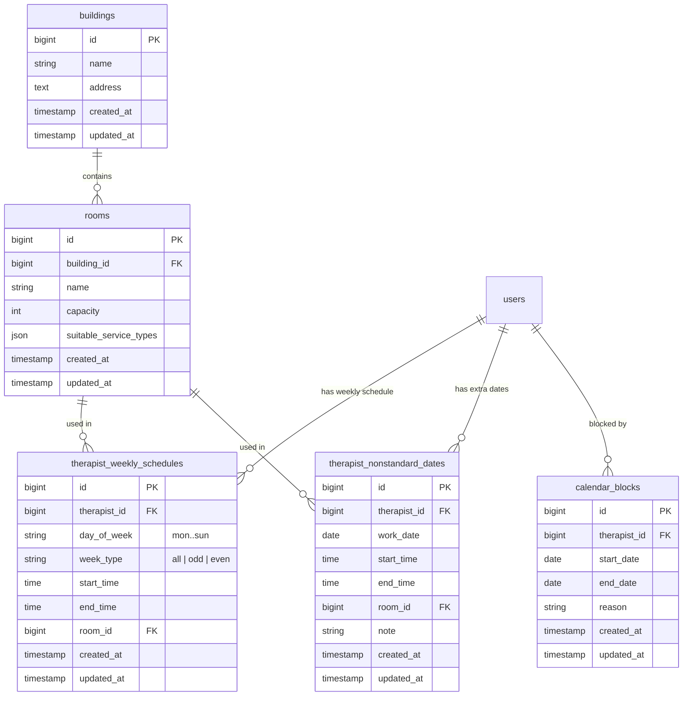
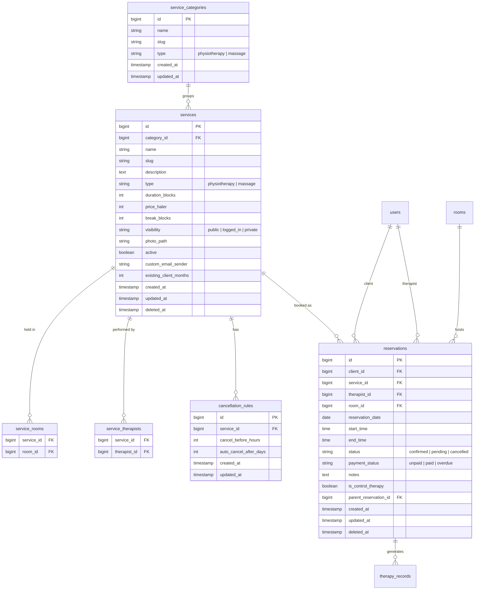
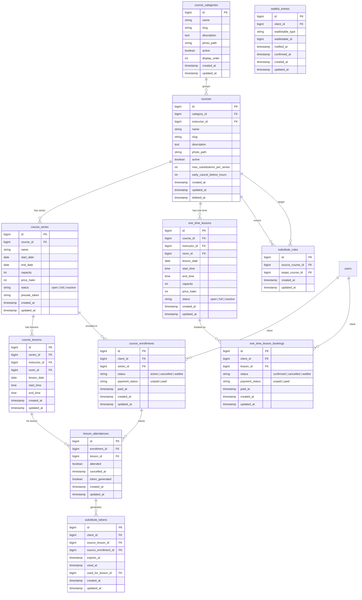
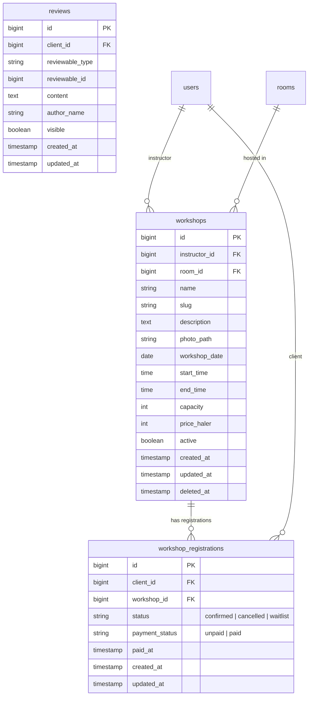
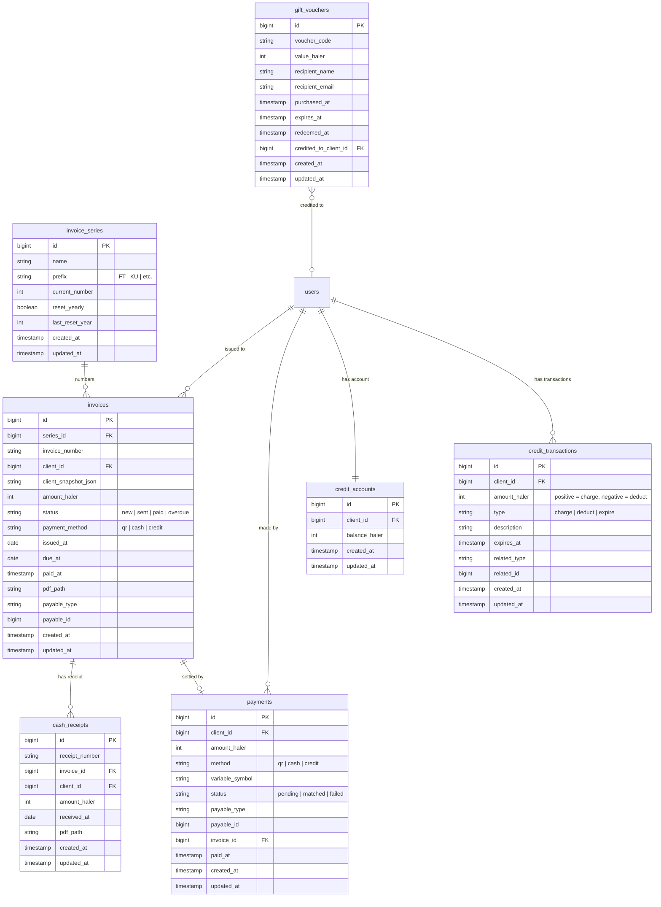
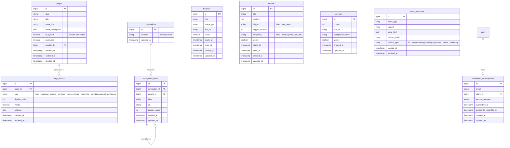

# FriendlyFyzio OS — Master Specification

**Version:** 1.0 | **Date:** 2026-06-01  
**Stack:** Laravel 13 · Filament 5 · Livewire 4 · PostgreSQL · Redis · Laravel Octane

> This is the single source of truth for the FriendlyFyzio application.  
> All previous documents in `docs/` are superseded by this file.

---

## Table of Contents

1. [Database Model](#1-database-model)
2. [Dashboard — Admin Panel](#2-dashboard--admin-panel)
3. [Public Website](#3-public-website)

---

## 1. Database Model

### 1.1 Conventions

| Convention | Rule |
|---|---|
| Primary keys | `bigint` auto-increment on every table |
| Timestamps | `created_at` / `updated_at` on every table |
| Soft deletes | `deleted_at` on entities that must preserve history |
| Money | Integers in haler (1 CZK = 100 haler). Display layer divides. |
| Duration | 15-minute blocks. 1 block = 15 min. |
| Enums | PHP-backed enums; stored as strings in DB. |

### 1.2 Schema Domains

The schema is organized into 5 logical domains:

| # | Domain | Core Tables |
|---|---|---|
| 1 | **Identity** | users, client_profiles, therapist_profiles |
| 2 | **Clinic** | buildings, rooms, therapist schedules, calendar blocks |
| 3 | **Services & Reservations** | services, courses, workshops, reservations, enrollments |
| 4 | **Financial** | payments, credits, invoices, cash receipts |
| 5 | **CMS** | pages, page blocks, navigation, banners, modals |

---

### 1.3 Domain 1 — Identity



---

### 1.4 Domain 2 — Clinic (Buildings, Rooms, Schedules)



---

### 1.5 Domain 3 — Services & Reservations

#### 3a — Services (Physiotherapy & Massage)



#### 3b — Courses & Lessons



#### 3c — Workshops



---

### 1.6 Domain 4 — Financial



---

### 1.7 Domain 5 — CMS



---

### 1.8 Full Table Inventory

| Domain | Table | Notes |
|---|---|---|
| Identity | `users` | Roles: admin, therapist, customer |
| Identity | `client_profiles` | Extended demographic data |
| Identity | `therapist_profiles` | Bio, photo, website display |
| Identity | `anamneses` | WYSIWYG health notes per client |
| Identity | `therapy_records` | Per-session WYSIWYG notes |
| Clinic | `buildings` | Clinic locations |
| Clinic | `rooms` | Ambulances and gyms |
| Clinic | `therapist_weekly_schedules` | Recurring schedule, per day, even/odd week |
| Clinic | `therapist_nonstandard_dates` | One-off extra working dates |
| Clinic | `calendar_blocks` | Vacations, sick days |
| Services | `service_categories` | Groups services by type |
| Services | `services` | Physiotherapy types & massage types |
| Services | `service_rooms` | Pivot: which rooms a service can be held in |
| Services | `service_therapists` | Pivot: which therapists perform a service |
| Services | `cancellation_rules` | Per-service storno rules |
| Reservations | `reservations` | Physiotherapy & massage bookings |
| Courses | `course_categories` | e.g. Jóga, Pro těhotné |
| Courses | `courses` | Course definition |
| Courses | `course_series` | A scheduled run of a course |
| Courses | `course_lessons` | Individual lessons within a series |
| Courses | `one_time_lessons` | Drop-in single lessons |
| Courses | `course_enrollments` | Client enrolled in a series |
| Courses | `lesson_attendances` | Per-lesson attendance tracking |
| Courses | `one_time_lesson_bookings` | Drop-in booking |
| Courses | `substitute_tokens` | Generated on early cancellation |
| Courses | `substitute_rules` | Which courses accept tokens from which |
| Courses | `waitlist_entries` | Polymorphic: series, workshop, lesson |
| Workshops | `workshops` | Single-event workshops |
| Workshops | `workshop_registrations` | Workshop enrollment |
| Shared | `reviews` | Polymorphic: service, course, workshop |
| Financial | `invoice_series` | Numbering series (FT, KU, etc.) |
| Financial | `invoices` | Auto-generated invoices with PDF |
| Financial | `cash_receipts` | PPD for cash payments |
| Financial | `payments` | All payment events |
| Financial | `credit_accounts` | Per-client credit balance |
| Financial | `credit_transactions` | Credit charge/deduct/expire log |
| Financial | `gift_vouchers` | Purchased vouchers |
| CMS | `pages` | All website pages |
| CMS | `page_blocks` | Content blocks on each page |
| CMS | `navigations` | Header / footer navigation |
| CMS | `navigation_items` | Nav items with parent-child |
| CMS | `banners` | Promotional banners |
| CMS | `modals` | Pop-up modals |
| CMS | `top_bars` | Announcement bar |
| CMS | `email_templates` | Per-event email templates |
| CMS | `newsletter_subscriptions` | MailerLite sync |

---

## 2. Dashboard — Admin Panel

**URL:** `/admin`  
**Auth:** Laravel Filament + Filament Shield (role-based access)  
**Brand:** Primary `#ED86A3`, Montserrat headings, Inter body, JetBrains Mono for codes

### 2.1 Roles & Access

| Role | SK label | Access |
|---|---|---|
| `admin` | Správce | Full access to all resources and settings |
| `therapist` | Terapeutka / Lektorka | Own calendar, own clients, own courses, record payment |
| `customer` | Klient | Own profile, own reservations, tokens, credit, invoices |

Single `/admin` panel. Filament Shield controls resource visibility per role.

### 2.2 Navigation — Admin

```
Dashboard
Calendar
─────────────────
Clients
Reservations
─────────────────
Services
Courses
Workshops
─────────────────
Rooms & Buildings
Working Hours
─────────────────
Invoices
Payments
Credits
─────────────────
Pages (CMS)
Banners / Modals / Top Bar
Navigation
─────────────────
Email Templates
MailerLite
─────────────────
Settings
Shield (Roles & Permissions)
```

### 2.3 Navigation — Therapist

```
Dashboard
My Calendar
─────────────────
My Clients
Reservations (filtered)
─────────────────
My Courses
─────────────────
Record Payment
```

### 2.4 Navigation — Customer

```
Dashboard
My Profile
─────────────────
My Reservations
My Tokens
My Credit
─────────────────
My Payments
My Invoices
```

---

### 2.5 Admin Views

#### Dashboard (Home)
Stats widgets:
- Today's appointment count
- Pending (unpaid) reservations
- New registrations this week
- Active courses count

Live widgets:
- **Today's schedule** — timeline of all therapists, color-coded
- **Revenue chart** — weekly/monthly by service type (Apex Charts)
- **Upcoming conflicts** — room double-bookings, therapist overlaps (danger cards)
- **Unpaid reservations** — overdue list
- **Waitlist activity** — recent cancellations and waitlist notifications

Quick actions: Create reservation | Add client | Block calendar | Generate invoice

---

#### Calendar
- Full-width week/day toggle
- Left filter: by therapist, by room, by service type
- 15-minute block grid in day view
- Color per therapist; gray stripe = blocked; light gray = break; red border = conflict
- Click empty block → create reservation
- Drag reservation → reschedule
- Room view toggle: rooms as columns

---

#### Clients (`ClientResource`)

**List columns:** Avatar · Full name · Email · Phone · Tags · Credit balance · Last visit

**Detail tabs:**

| Tab | Contents |
|---|---|
| Profile | Name, surname, email, phone, DOB, city, occupation, weight, height, IČO, DIČ, billing address |
| Anamnesis | WYSIWYG (therapist-managed; hidden from client in MVP) |
| Therapy Records | List of sessions with WYSIWYG notes |
| Reservations | Upcoming + history, filterable |
| Payments | All payments: method, status, linked invoice |
| Credit | Balance, validity, charge/deduct history |
| Substitute Tokens | Active, used, expired |
| Invoices | List with PDF download |
| Notes | Internal staff-only notes |

---

#### Reservations (`ReservationResource`)

**Tabs:** All | Physiotherapy | Massages | Courses | One-time Lessons | Workshops

**List columns:** Date/Time · Client · Service · Therapist · Room · Status · Payment status

**Filters:** Date range · Therapist · Service type · Status · Payment status

**Create form (wizard):**
1. Service type tiles (icons + photos)
2. Client search/create inline
3. Therapist selector
4. Date/time picker — only shows valid 15-min slots (gap-fill algorithm)
5. Room auto-assigned from therapist + day schedule
6. Notes + recurring option (control therapies)

**Booking algorithm for physiotherapy & massage:**  
Slots are offered from anchors (start of shift, and end-of-reservation + break). On days with existing reservations, new slots are only offered where they fit precisely — no gaps created. See reservation-system-logic.md for full case examples.

---

#### Services (`ServiceResource`)

**Fields:** Name · Description (WYSIWYG) · Category · Duration (blocks) · Price · Break (blocks, per therapist) · Assigned therapists · Assigned rooms · Cancellation rules · Visibility · Photo · Active toggle · Custom sender email

**Visibility options:**
- `public` — visible to all
- `logged_in` — visible to existing clients (within last X months, configurable)
- `private` — therapist-only (control therapies)

---

#### Courses (`CourseResource`)

**List:** Name · Category · Status · Enrolled/Capacity · Series count

**Detail tabs:**

| Tab | Contents |
|---|---|
| Info | Name, category, description, photo, active/inactive, price |
| Series | List of series; each with date range, lessons, capacity |
| Lessons | Per-lesson: date, time, instructor, room, attendees, reschedule + notify |
| Enrollments | Enrolled clients per series with payment status |
| Waitlist | Waiting clients, notify button |
| Substitute Rules | Max substitutions, accepted courses, early-cancel deadline |
| Reviews | Client testimonials (shown on website) |
| Pre-sale Links | Generate hidden links for early access |

---

#### Workshops (`WorkshopResource`)

Fields: Name · Description · Date/Time · Capacity · Price · Instructor · Room · Photo · Active · Reviews · Waitlist

---

#### Working Hours (`TherapistScheduleResource`)

Per therapist:
- **Weekly recurring:** per day — time blocks + room assignment; even/odd week toggle
- **Non-standard dates:** one-off additions
- **Calendar blocks:** multi-day vacation/sick/training

Visual: weekly grid with colored room assignment badges + block reasons.

---

#### Rooms & Buildings (`RoomResource`)

**Buildings:** Name, address, room list  
**Rooms:** Name, building, capacity, suitable service types  
**Occupancy view:** Color-coded weekly grid per room showing all reservations

---

#### Invoices (`InvoiceResource`)

**List columns:** Invoice # · Date · Client · Amount · Service type · Method · Status

**Statuses:** New → Sent → Paid / Overdue (auto-marked by due date)

**Actions:** Download PDF · Send email · Mark as paid · Bulk ZIP · Export Excel (for accountant)

**Numbering series:** Configurable prefix (e.g. `FT-2026-001`, `KU-2026-001`), auto-reset yearly.

**Cash receipt (PPD):** Separate series, auto-generated on cash payment recording.

**Invoice generation triggers:**
1. Air Bank IMAP email received → match by variable symbol → generate + attach to payment email
2. Therapist records cash payment → generate on client request
3. Therapist deducts credit → no invoice generated (client already paid for credits separately)

---

#### Payments (`PaymentResource`)

Overview of all payment events. Sources:
- **QR / Bank transfer** — matched via IMAP (Air Bank notification emails)
- **Cash** — manually recorded by therapist
- **Credit** — one-click deduction by therapist

---

#### Credit System (`CreditResource`)

Per-client view: balance, validity (configurable, e.g. 6 months), charge/deduct history.  
1 credit = 1 CZK.  
Admin/therapist can add credit (manual or from gift voucher redemption).

---

#### CMS — Pages (`PageResource`)

**System pages** (cannot be deleted, only hidden): Homepage · Pricing · Team · Contact

**Custom pages:** Slug + meta title + meta description, freely created.

**Block builder (drag & drop order):**

| Block type | Configuration |
|---|---|
| WYSIWYG | Rich text, headings, lists, images |
| Hero Banner | Heading, subtitle, CTA buttons, background image |
| Reviews | Testimonials carousel |
| Service Categories | Cards with links |
| Service List | Dynamic from database |
| Active Courses | Auto-populated with capacities |
| Workshops | Upcoming list |
| Team Profiles | Staff cards |
| Instagram Feed | Dynamic embed |
| Contact / Registration Form | Configurable |
| Map | Google Maps embed |
| CTA Section | Heading + button |

Per block: visibility toggle, display order, custom settings (background color, columns, item selection).

---

#### Special Elements

**Banners:** Image + link + visibility date range  
**Modals:** Trigger (timer / exit intent) · Frequency (once / daily / always) · Visibility dates  
**Top bar:** Announcement text + link + color + visible toggle

---

#### Navigation Editor

**Header:** Add/edit/delete items with dropdown sub-menus  
**Footer:** Columns, links, text

---

#### Email Templates (`EmailTemplateResource`)

One template per event type:

| Event | Sent to |
|---|---|
| Reservation confirmed | Client + Therapist |
| Reservation reminder (24h before, configurable) | Client |
| Reservation cancelled / changed | Client + Therapist |
| Waitlist spot available | Waiting client |
| Payment received (invoice PDF attached) | Client |
| Payment overdue reminder | Client |
| Substitute token generated | Client |
| Course lesson rescheduled | All enrolled clients |

Per service type: custom sender email address.

---

#### Settings

| Group | Settings |
|---|---|
| Clinic | Name, address, IČO, bank account (for QR codes) |
| Cancellations | Rules per service type (hours before, auto-cancel days) |
| Credit | Validity period (months) |
| Tokens | Substitute token validity (days) |
| Reminders | Hours before reminder email |
| Invoices | Numbering series config |
| Bank | IMAP credentials for Air Bank payment matching |
| Integrations | Google Calendar sync, MailerLite API key |

---

### 2.6 Therapist Views

#### Therapist Dashboard
Widgets: My Today (personal timeline) · My Week · My Stats (monthly) · Pending Notes (sessions missing records)

#### My Calendar
Personal schedule only. Can create/edit own reservations, block own time, create recurring control therapy series, see room assignments.

#### My Clients
Only clients they have treated. Full access to anamnesis, therapy records, reservations. Can charge/deduct credit. Can manage substitute tokens.

#### My Courses
Courses they instruct. Attendee list per lesson. Mark attendance. Reschedule lesson + notify participants.

#### Record Cash Payment
Quick action: select client → enter amount → confirm → auto-generates invoice if requested.

---

### 2.7 Customer Views

#### Customer Dashboard
Widgets: My Upcoming (cards with cancel button if within window) · My Tokens (with "Use token" CTA) · My Credit (balance + validity)

Quick actions: View reservations · View invoices · Edit profile

#### My Profile
Name, surname, email, phone, change password, company billing details (IČO, DIČ, billing address).

#### My Reservations
Tabs: Upcoming | Past  
Per card: date, time, service, therapist, room, status, cancel button (within window only).

#### My Substitute Tokens
Active tokens with expiry. "Use token" → shows compatible substitute slots (not visible to public).  
History of used/expired tokens.

#### My Credit
Balance + expiry info. Charge/deduction/expiry history with running balance.

#### My Payments
Date · Amount · Method · Service · Linked invoice

#### My Invoices
List with PDF download. Status: Paid / Overdue.

#### My Courses
Enrolled courses, substitute token status, waitlist status.

---

### 2.8 Key UI Patterns

**Status badges:**

| Status | Color |
|---|---|
| Confirmed, Paid | Success green |
| Pending, Full | Warning amber |
| Cancelled, Overdue | Danger red |
| Active | Primary pink |
| Inactive, Unpaid | Neutral gray |

**Calendar:** 15-min grid · color per therapist · gray stripe = blocked · light gray = break · red border = conflict · hover tooltip (client, service, duration)

**Service selection forms:** Visual tiles with photos, not dropdowns.

**Client selector:** Searchable autocomplete with inline create.

**WYSIWYG:** Used for anamnesis, therapy records, page blocks, service descriptions.

---

## 3. Public Website

**URL:** `www.friendlyfyzio.cz`  
**Language:** Czech  
**Stack:** Laravel Blade templates + Tailwind CSS v4, content from CMS  
**Location:** FriendlyFyzio, Zednická 1109/2, Ostrava-Poruba  
**Owner:** Mgr. Lucie Fičkerová, +420 604 793 255, info@friendlyfyzio.cz, IČO: 06816967

### 3.1 Brand

| Token | Value |
|---|---|
| Primary | `#ED86A3` |
| Primary Light | `#FFDBE5` |
| Neutral 900 | `#1A1A1A` |
| White | `#FFFFFF` |
| Heading font | Montserrat Semi-Bold / Bold |
| Body font | Open Sans |

Logo: "Friendly" regular weight, "*Fyzio*" italic/script, pink accent on Fyzio.

---

### 3.2 Global Elements

**Header navigation:**  
Fyzioterapie | Laser/kryoterapie | Pohybové kurzy | Relaxace | Workshopy | Ceník | O nás | [CTA: Chci se objednat]

**Top bar (optional):** Admin-configurable announcement with link and color.

**Footer:** Logo · Nav links · Contact info · Social links · Newsletter signup · Copyright + IČO

**Contact section** (on every page):
> Mgr. Lucie Fičkerová · +420 604 793 255 · info@friendlyfyzio.cz  
> Online rezervace vstupního vyšetření · Online rezervace masáží  
> FriendlyFyzio, Zednická 1109/2, Ostrava-Poruba

---

### 3.3 Site Map

> **SEO note:** URLs marked with `← live` match the current production site (`www.friendlyfyzio.cz`) and must be preserved exactly. New pages (marked `← new`) can use any slug. Pages removed from the old site need 301 redirects — see §3.8.

```
/                                         Homepage
/fyzioterapie                             Fyzioterapie (overview)
  /terapie-panevniho-dna                  ← live
  /tehotenska-fyzioterapie                ← live
  /terapie-jizev                          ← live
  /terapie-celistniho-kloubu              ← live
/pristrojova-terapie                      Přístrojová terapie (overview, info only) ← live
  /lokalni-kryoterapie                    ← live
  /vysokovykonny-laser                    ← live (old site slug; keep for SEO)
  /ultrazvuk                              ← new (nav item designed, page TBD)
  /elektroterapie                         ← new (nav item designed, page TBD)
/fyzio-kurzy                              Pohybové kurzy (overview) ← live
  /joga                                   ← live
  /pro-tehotne-zeny                       ← live
  /sm-core-system
  /mami-a-mimi                            ← live
  /mobility-stretch                       ← live
  /restart-po-cisarskem-rezu
  /principy-pohybu
  /cviceni-pro-zeny-po-rakovine-prsu      ← live
/relaxace                                 Masáže & Relaxace (overview) ← live
  /lymphaticke-masaze                     ← new (split from old /relaxace-ritualy/masaze)
  /tehotenske-masaze                      ← new (split from old /relaxace-ritualy/masaze)
  /masaze-miminek-a-deti                  ← new
  /bylinna-naparka                        ← new (old: /relaxace-ritualy/bylinna-naparka)
  /relaxacni-ritualy                      ← new (nav item designed, page TBD)
/workshopy                                Workshopy (overview) ← live
  /{slug}                                 Workshop detail
/cenik                                    Ceník ← live
/nas-tym                                  Náš tým ← live
  /{slug}                                 Terapeut detail ← new
/darkove-poukazy                          Dárkové poukazy ← live
/kontakt                                  Kontakt ← new
/rezervace-vstupniho-vysetreni            Rezervace vstupního vyšetření ← live
/rezervace-masazi                         Rezervace masáží ← live
/kurzy/{slug}/prihlaseni                  Enrollment page (courses & workshops)
/prihlaseni                               Login ← new
  /zapomenute-heslo                       Zapomenuté heslo ← new
  /obnova-hesla                           Obnovení hesla ← new
/registrace                               Registrace ← new
/overeni-emailu                           Ověření emailu ← new
/muj-ucet                                 Client zone (authenticated) ← new
```

---

### 3.4 Pages

#### Homepage (`/`)

| Section | Content |
|---|---|
| Hero | "Specializovaná fyzioterapie" · specializations list · hero image · 3 CTAs: Objednat vstupní vyšetření / Chci na masáž / Koupit dárkový poukaz |
| Announcement banners | Dynamic from admin (enrollment periods, events) |
| Services overview "Naše nabídka" | 4 category cards: Fyzioterapie · Pohybové kurzy · Masáže a relaxace · Laser/kryoterapie |
| Currently enrolling | Dynamic: courses/workshops open for enrollment |
| Testimonials "Doporučení našich klientů" | Carousel |
| Instagram feed | Dynamic embed |
| Contact section | Standard |
| Newsletter signup | Email + consent |
| Google Maps | Clinic location embed |

---

#### Fyzioterapie (`/fyzioterapie`)

Intro text about physiotherapy. 4 therapy type cards linking to subpages. CTA to booking. Reviews. Contact section.

**Therapy subpages (shared template):**

| URL | Heading |
|---|---|
| `/fyzioterapie/terapie-panevniho-dna` | Terapie pánevního dna |
| `/fyzioterapie/tehotenska-fyzioterapie` | Těhotenská fyzioterapie |
| `/fyzioterapie/terapie-jizev` | Terapie jizev |
| `/fyzioterapie/terapie-celistniho-kloubu` | Terapie čelistního kloubu |

Each subpage: featured image · WYSIWYG content (from CMS) · CTA to booking · Client reviews specific to this therapy type · Contact section.

---

#### Přístrojová terapie (`/pristrojova-terapie`)

Information only — **no online booking**. Phone booking only.

**Services (designed subpages):**

| URL | Service | Notes |
|---|---|---|
| `/pristrojova-terapie/lokalni-kryoterapie` | Lokální kryoterapie | Cold therapy, acute pain, injuries, post-op support |
| `/pristrojova-terapie/vysokovykonny-laser` | Vysokovýkonný laser | Therapeutic laser up to 4cm depth, pain relief, healing support |

**Navigation dropdown items (pages TBD):**

| URL | Service |
|---|---|
| `/pristrojova-terapie/ultrazvuk` | Ultrazvuk |
| `/pristrojova-terapie/elektroterapie` | Elektroterapie |

Each designed subpage: detailed description + phone-booking note + contact section.

---

#### Pohybové kurzy (`/fyzio-kurzy`)

Grid of course category tiles (photo + name + status badge).

**Inactive categories** shown muted: "Momentálně nepřihlašujeme" or "Brzy".

**Category detail pages (8 pages, shared template):**

| URL | Category | Notes |
|---|---|---|
| `/fyzio-kurzy/joga` | Jóga (Hormonální, Somatická, Jin) | ← live |
| `/fyzio-kurzy/pro-tehotne-zeny` | Pro těhotné | ← live |
| `/fyzio-kurzy/sm-core-system` | SM a CORE systém | |
| `/fyzio-kurzy/mami-a-mimi` | Mami&Mimi | ← live |
| `/fyzio-kurzy/mobility-stretch` | Mobility&Stretch | ← live |
| `/fyzio-kurzy/restart-po-cisarskem-rezu` | Restart po císařském řezu | |
| `/fyzio-kurzy/principy-pohybu` | Principy pohybu pro začátečníky | |
| `/fyzio-kurzy/cviceni-pro-zeny-po-rakovine-prsu` | Pro ženy po rakovině prsu | ← live |

Each category page: hero + description · list of course types within category (description, schedule, price, instructor) · links to enroll or drop-in · substitute rules notice · Reviews section · Contact section.

---

#### Relaxace & Masáže (`/relaxace`)

Overview page with two visual sections: **Masáže** (4 service cards) and **Relaxace** (ritual cards). CTA to massage booking. Contact section.

**Designed subpages:**

| URL | Service | Notes |
|---|---|---|
| `/relaxace/lymphaticke-masaze` | Manuální lymfatické masáže | New; old site combined under `/relaxace-ritualy/masaze` |
| `/relaxace/tehotenske-masaze` | Těhotenské masáže | New; old site combined under `/relaxace-ritualy/masaze` |
| `/relaxace/masaze-miminek-a-deti` | Masáže miminek a dětí | |
| `/relaxace/bylinna-naparka` | Bylinná napářka | Old: `/relaxace-ritualy/bylinna-naparka` |

**Navigation dropdown item (page TBD):**

| URL | Item |
|---|---|
| `/relaxace/relaxacni-ritualy` | Relaxační rituály |

Each subpage: description · duration · for whom · CTA to booking · Reviews · Contact section.

> **Note:** Jin Jóga was in the original scope but is **not** in the confirmed design. Removed.

---

#### Workshopy (`/workshopy`)

Dynamic grid of workshops with date on tile.  
Inactive workshops shown muted.

**Workshop detail page** (per slug):
- Full description · Date/time · Location · Capacity (spots remaining) · Price · Instructor · Registration form · If full: waitlist · Reviews · Contact section

---

#### Ceník (`/cenik`)

Admin-managed pricing. Tabs:

| Tab | Services included |
|---|---|
| Fyzioterapie a kurzy | Vstupní vyšetření, kontrolní terapie, kurzy, lekce, individuální trenink |
| Masáže | All massage types and durations |
| Laser/kryo | Kryoterapie, laseroterapie |
| Ostatní | Gift vouchers, kinesiotaping, cross tape |

Payment note: Cash or QR bank transfer. No insurance accepted. No prescription requests.

Storno podmínky: summarized from admin settings.

---

#### Náš tým (`/nas-tym`)

Team group photo. Staff cards: photo · name · role · specializations · bio. Each card links to the therapist's detail page.

**Current team:**
Mgr. Lucie Fičkerová (owner, physio) · Mgr. Renata Barová · Karolina Krystůfková · Mgr. Šárka Matchová · Mgr. Daniela Balušíková · Simona Hořínová · Kristýna Černá · Blanka Černá · Denisa Neuwirthová

Section: "Spolupracující terapeuti" (collaborating external therapists).

#### Terapeut Detail (`/nas-tym/{slug}`)

Individual profile page per therapist. Content sourced from `therapist_profiles`.

Sections: large hero photo · name + role · bio (WYSIWYG) · specializations list · services they perform (links to service pages) · reviews by their clients · CTA to book with this therapist · Contact section.

---

#### Rezervace vstupního vyšetření (`/rezervace-vstupniho-vysetreni`)

**6-step booking wizard** (same structure as Masáže wizard):

| Step | Screen | Content |
|---|---|---|
| 1 | Terapeut | Select therapist (photo card tiles) or skip to browse by time |
| 2 | Kategorie | Service category tiles |
| 2a | Login Required | Shown when service requires logged-in client (logged_in visibility) |
| 2b | Reactivation Required | Shown when client has been inactive >1 year |
| 3 | Služba | Specific service tiles (photo, duration, price) |
| 4 | Datum | Calendar date picker; only shows valid days |
| 5 | Čas | Available 15-min time slots for selected date |
| 6 | Údaje | Contact form (new client) or confirmation (existing client) |
| 6a | Email Exists | Email already in system — offer to log in |
| — | Success | Confirmation screen + summary |
| — | Error | Booking failed screen |

**Step 6 form fields (new client):**
- First name, last name
- Problem description / week of pregnancy
- Phone (primary + backup)
- Email
- Checkbox: agree to cancellation terms
- Checkbox: newsletter

Submit: "Závazná objednávka"

**Info visible before/during booking:**
- Vstupní vyšetření trvá 90 minut
- Lze využít těhotenské a porodní příspěvky z pojišťovny, fond FKSP či Benefit
- Zdravotnické zařízení — razítko na propustce do práce
- Fallback: "Nevyhovuje Vám žádný termín? Kontaktujte nás: +420 604 793 255"

---

#### Rezervace masáží (`/rezervace-masazi`)

**6-step booking wizard** — identical structure to the fyzioterapie wizard.

| Step | Screen | Content |
|---|---|---|
| 1 | Terapeut | Select therapist (photo card tiles) or skip |
| 2 | Kategorie | Massage category tiles |
| 2a | Login Required | Shown for logged_in-visibility services |
| 2b | Reactivation Required | Shown when client inactive >1 year |
| 3 | Služba | Specific massage tiles (photo, duration, price) |
| 4 | Datum | Calendar date picker |
| 5 | Čas | Available time slots |
| 6 | Údaje | Contact form (new client) or confirmation (existing) |
| 6a | Email Exists | Email in system — offer to log in |
| — | Success | Confirmation + summary |
| — | Error | Booking failed |

**Step 6 form fields:**  
Name/surname · Notes (e.g. type of massage, pregnancy week) · Phone (primary + backup) · Email · Terms + Newsletter checkboxes

> Bylinná napářka is booked by phone/email only — it does not go through the online wizard.

---

#### Dárkové poukazy (`/darkove-poukazy`)

| Voucher | Price |
|---|---|
| Relaxační masáž 90 min | 1 300 Kč |
| Těhotenská masáž 90 min | 1 400 Kč |
| Vstupní vyšetření s fyzioterapeutem | 1 750 Kč |
| Vstupní vyšetření + 3 kontrolní terapie | 5 500 Kč |
| Vstupní vyšetření + 5 kontrolních terapií | 7 500 Kč |
| Volný poukaz (na všechny služby) | 2 000 Kč+ |
| 7× ošetření laserem s kryoterapií | 2 800 Kč |

**MVP:** Redirects to SimpleShop for purchase. Therapist then manually credits the client's account.  
**Future phase:** Built-in purchase + PDF voucher generation.

---

#### Course/Workshop Enrollment Page (`/kurzy/{slug}/prihlaseni`)

Dynamic page per course/workshop. Three states:

| State | Condition | UI |
|---|---|---|
| Open (mid-series) | Series active, spots available, started | Registration form + note that series is already in progress |
| Full / Waitlist | No spots remaining | Waitlist signup form |
| Disabled | Registration not open / series inactive | Info message only, no form |

**Registration form (open state):**
- Summary: name, schedule, price, spots remaining
- Form: name, surname, email, phone, note
- QR code for payment (auto-generated with variable symbol)
- Terms checkbox · Submit
- Post-registration: confirmation message + email with QR payment details

---

#### Kontakt (`/kontakt`)

Full contact page. Sections: contact details (name, phone, email), address, online booking CTAs, Google Maps embed, contact form.

---

#### Login (`/prihlaseni`)

Logo · Email + password · Login button · "Zapomněli jste heslo?" link · Link to registration  
Note: "Účet je vytvořen automaticky při první rezervaci."

#### Zapomenuté heslo (`/prihlaseni/zapomenute-heslo`)

Email input form. Submit sends a password-reset link to the email address.

#### Obnovení hesla (`/prihlaseni/obnova-hesla`)

New password + confirm password fields. Reached via link in reset email.

#### Ověření emailu (`/overeni-emailu`)

Email verification confirmation screen. Reached via link in verification email sent after registration or first booking.

#### Registrace (`/registrace`)

Manual registration form for users who want to create an account before making a reservation.  
Fields: first name, last name, email, phone, password, password confirmation, newsletter checkbox.

---

#### Klientská zóna (`/muj-ucet`)

Authenticated client area. Sidebar navigation mirrors customer dashboard sections.

| Section | Contents |
|---|---|
| Dashboard | Upcoming reservations summary · active tokens · credit balance |
| Můj profil | Name, email, phone, password change, billing details (IČO, DIČ, address) |
| Moje rezervace | Upcoming + past tabs. Each row links to reservation detail. Cancel button within window. |
| Moje kurzy | Enrolled courses, substitute token status, waitlist status |
| Moje náhradové tokeny | Active tokens + "Use token" flow |
| Můj kredit | Balance + expiry + charge/deduct/expiry history |
| Moje platby | Date · amount · method · service · invoice link |
| Moje faktury | PDF download list · status (Paid / Overdue) |

Account is created automatically on first reservation. Login credentials sent by email.

**Reservation Detail page** — reached from Moje rezervace. One URL per reservation, states:

| State | Screen name |
|---|---|
| Potvrzeno | Reservation Detail – Potvrzeno |
| Čeká na potvrzení | Reservation Detail – Čeká na potvrzení |
| Čeká na platbu (QR/bank) | Reservation Detail – Čeká na platbu |
| Čeká na platbu — Hotově | Reservation Detail – Čeká na platbu (Hotově) |
| Čeká na platbu — Kredit | Reservation Detail – Čeká na platbu (Kredit) |
| Dokončeno | Reservation Detail – Dokončeno |
| Stornováno | Reservation Detail – Stornováno |

Each detail screen: service, date/time, therapist, room, status badge, payment instructions (QR code if applicable), cancel / reschedule actions within their respective windows.

**Přesunout rezervaci (`/muj-ucet/rezervace/{id}/presunout`):**  
Client-facing reschedule flow. Shows available alternative slots. Disabled with an explanation modal when rescheduling is not allowed (too close to appointment).

---

### 3.5 Booking Rules Summary

| Service | Booking method | Payment | Cancellation |
|---|---|---|---|
| Fyzioterapie — vstupní | 6-step online wizard (public) | On-site after service | By 17:00 previous day; health reason only same-day |
| Fyzioterapie — kontrolní | Therapist-only in admin | On-site after service | Same as above |
| Masáže | 6-step online wizard (public) | On-site after service | By 17:00 previous day |
| Bylinná napářka | Phone/email only | On-site | — |
| Laser/kryoterapie + Ultrazvuk + Elektroterapie | Phone only | On-site | — |
| Pohybové kurzy | Online enrollment form | QR bank transfer (advance) | Up to X days before series start (configurable) |
| Jednorázové lekce | Online enrollment | QR bank transfer (advance) | Up to X hours/days before (configurable) |
| Workshopy | Online enrollment | QR bank transfer (advance) | Up to X days before (configurable) |

---

### 3.6 Inactive Items Display

- **Courses/categories:** tile displayed as muted/gray, labeled "Momentálně nepřihlašujeme" or "Brzy"
- **Workshops:** listed but muted, no registration button
- Inactive items are informational — they signal that the service exists even when not currently enrolling

---

### 3.7 Shared Page Components

| Component | Used on |
|---|---|
| Contact section | Every page |
| Reviews/Testimonials | Homepage, therapy subpages, course category pages, workshops |
| Newsletter signup | Homepage, footer |
| Google Maps | Homepage, contact section, /kontakt |
| CTA to booking | Fyzioterapie, Relaxace, course pages, therapist detail |
| Inactive badge | Course tiles, workshop tiles |

---

### 3.8 SEO URL Redirect Map

301 redirects required on launch to preserve existing search engine rankings:

| Old URL (live site) | New URL | Notes |
|---|---|---|
| `/rezervace-vstupniho-vysetreni` | `/rezervace-vstupniho-vysetreni` | Same — no change needed |
| `/relaxace-ritualy/masaze` | `/relaxace/lymphaticke-masaze` | Split into two pages; redirect to lymfatické as closest match |
| `/relaxace-ritualy/bylinna-naparka` | `/relaxace/bylinna-naparka` | Path change only |
| `/fyzio-kurzy/pro-tehotne-zeny` | `/fyzio-kurzy/pro-tehotne-zeny` | Same — no change |
| `/fyzio-kurzy/cviceni-pro-zeny-po-rakovine-prsu` | `/fyzio-kurzy/cviceni-pro-zeny-po-rakovine-prsu` | Same |
| `/fyzio-kurzy/mami-a-mimi` | `/fyzio-kurzy/mami-a-mimi` | Same |
| `/pristrojova-terapie/vysokovykonny-laser` | `/pristrojova-terapie/vysokovykonny-laser` | Same |
| `/prihlaska-na-jednorazove-vstupy` | `/kurzy/jednorazove-lekce/prihlaseni` | Old one-time lesson enrollment URL |

> URLs marked "Same" are confirmed matches between old and new site — no redirect needed.
